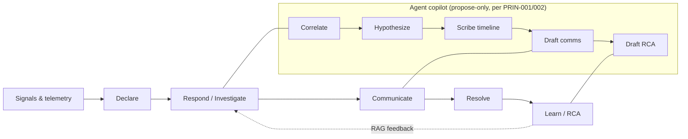
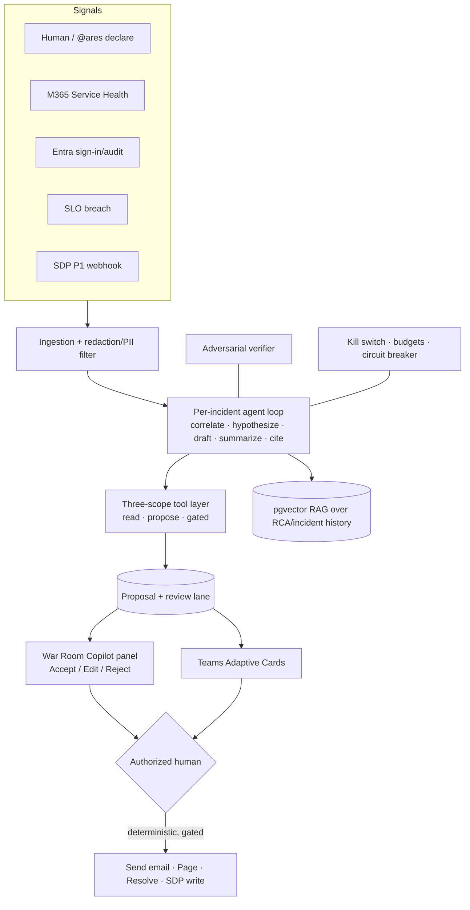
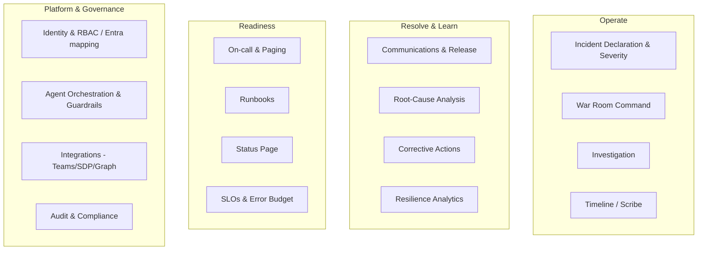
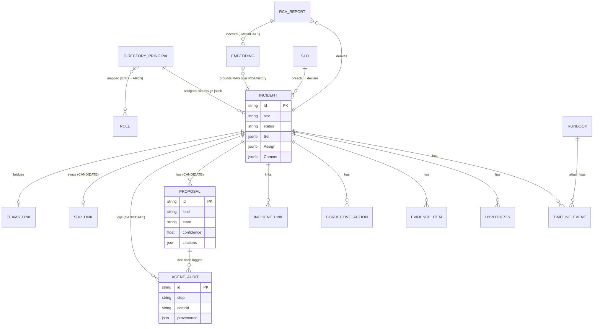
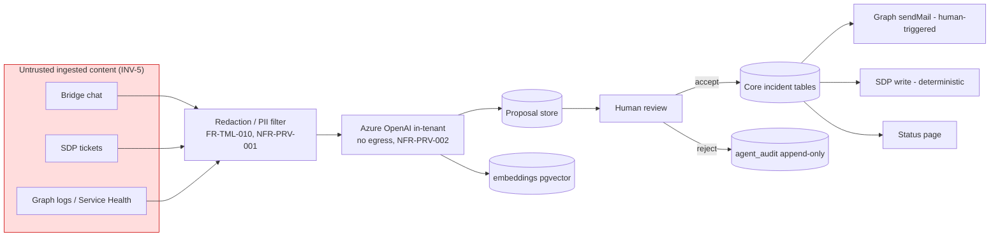
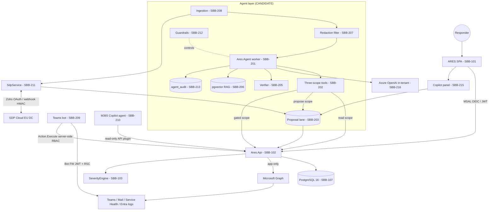
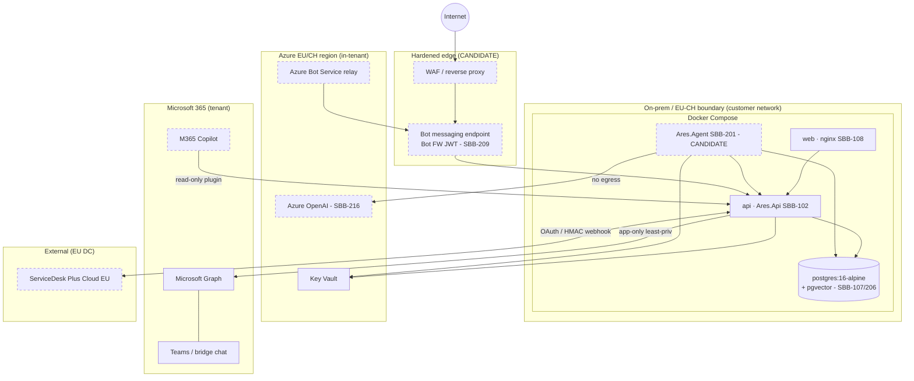

# 10 · ARES — TOGAF Architecture (ADM Phases A–D + Requirements Management)

> **Status:** Draft for review · **Nature:** Documentation only — *no build/implementation
> is authorized by this document.* This is a TOGAF-ADM architecture description for the
> **agentic-AI evolution** of ARES, layered on the shipped incident-command platform.
>
> **Read alongside:** `00-index.md` (IDs, invariants INV-1…6, glossary, stakeholders),
> `01-candidate-requirements.md` (authoritative FR-/NFR-/US-/CON-/ASM- IDs referenced here),
> `CLAUDE.md` (product spec), `agent-design-and-threat-model.md` (design annex),
> `20-iso27001-42001.md`, `21-mitre-zerotrust.md`, `22-privacy-ai-regulation.md`
> (compliance frameworks adopted in the Preliminary Phase).
>
> **Tagging:** every component/entity/interface is marked **[SHIPPED]** (present in the
> current ARES build) or **[CANDIDATE]** (designed, not yet built). The shipped baseline is
> the ground truth in the *Shipped Inventory* below; candidate elements trace to the
> `[CANDIDATE]` requirements in doc 01.
>
> **ID conventions used in this document** (per `00-index.md §2`): `PRIN-###` principles ·
> `STK-##` stakeholders · `ABB-###` architecture building blocks · `SBB-###` solution
> building blocks · `RISK-###` architecture risks · `ADR-###` decisions. FR-/NFR- IDs are
> owned by doc 01 and only referenced here.

---

## 0. Shipped baseline (architecture ground truth)

The `[SHIPPED]` layer that all candidate work extends (never replaces):

- **Backend** — ASP.NET Core 8 (`Ares.Api`, single project, minimal hosting). EF Core 8 +
  Npgsql / PostgreSQL 16; migrations applied on boot with seed + retry.
  Microsoft.Identity.Web 3.15.1 (JWT), Azure.Identity, Microsoft.Graph 5.61, Swashbuckle.
  - **Entities:** `Incident` (Id string; jsonb `Sel`/`Assign`/`Comms`; `TeamsChannelId`/`Url`)
    with children `TimelineEvent` / `Hypothesis` / `EvidenceItem` / `CorrectiveAction`
    (composite key `{IncidentId, Id}`, cascade delete); `DirectoryPrincipal`
    (`Roles` jsonb, `EntraId`/`EntraSource`); `IncidentLink`; `ReadinessDoc`
    (jsonb oncall / statusPage); `Runbook` (`Steps` jsonb); `Slo`.
  - **Controllers:** `IncidentsController` (CRUD + child add/patch/cycle/delete + assign +
    comms edit/approve + links), `DirectoryController`, `MetaController` (roles, config),
    `AdminEntraController` (Graph import: groups/members/apps/assignments/import),
    `EmailController` (email-draft + send), `TeamsController` (status/provision/post-card),
    `ReadinessController`, `RunbooksController`, `SlosController`, `/health`.
  - **Services:** `GraphService` (app-only client-credentials: import + `sendMail` + Teams
    channel / Adaptive Card), `AdaptiveCardBuilder`, `EmailTemplate` (Birgma house style),
    `SeverityEngine` (deterministic `Compute`), `RolesCatalogue` (15 roles), `Options`
    (Entra/Mail/Teams/Ares), `AresDbContextFactory` (design-time).
  - **Auth:** JWT only when Entra configured; `AllowDemoAuth=true` fail-open default; CORS
    wildcard default; secrets via env / compose.
- **Frontend** — React 18 + TS strict + Vite 5; Zustand store (no router — the active view is
  state); MSAL (`msal-browser`) with demo fallback; typed `api` client over `fetch`; three
  themes (Command / Daylight / Carbon) as CSS-var token maps; 16 screens in `screens/` +
  `registry.tsx`; modals Assign / Email / Delete / Import; `severity.ts` ported in lockstep
  with the backend engine; 5 runtime deps; nginx Dockerfile proxying `/api`.
- **Runtime** — `docker-compose` (db `postgres:16-alpine`, api, web nginx). On-prem;
  EU/CH residency intent; in-tenant model target.

---

# PRELIMINARY PHASE — Principles & Frameworks

## P.1 Architecture principles (PRIN-###)

Principles are derived directly from the six governing invariants (`00-index.md §4`,
restated as INV-1…6 in doc 01 §0). Each principle carries the TOGAF *statement /
rationale / implication* shape (condensed) and the invariant(s) and requirements it anchors.

| ID | Principle | Statement & rationale | Key implications | Anchors |
|---|---|---|---|---|
| **PRIN-001** | **Human-in-the-loop** | The agent is a copilot, not an autopilot. Every proposal is accepted by a human; every outbound/irreversible action needs an explicit human trigger. | Proposal/review lane; Accept/Edit/Reject UI; friction on SEV-1; graceful degradation to manual. | INV-1, INV-2 · FR-AGT-004, NFR-AI-001, FR-AGT-015 |
| **PRIN-002** | **Propose, don't decide** | The model drafts and correlates; it never commits state or sets classifications. | Agent writes only to the proposal store; acceptance materializes via existing human endpoints. | INV-1 · FR-AGT-002/003, FR-INV-005, FR-COM-007 |
| **PRIN-003** | **Deterministic severity** | Severity/priority/status are rule-computed by `SeverityEngine`, never model-inferred. | Severity recomputed at human confirmation of any agent-proposed incident; no model in the path. | INV-3 · FR-INC-002/009, NFR-AI-007 |
| **PRIN-004** | **Least privilege** | Every identity (human, service, agent) holds the minimum scope; the agent DB identity cannot write production. | Three-scope tools; RSC per-chat; scoped Graph app roles; scoped DB grants. | INV-6 · FR-AGT-002/003, NFR-SEC-007, CON-007/009 |
| **PRIN-005** | **In-tenant data & model** | Incident/personal data and inference stay inside the CH/EU compliance boundary; no egress to external model endpoints. | Azure OpenAI in-tenant EU/CH region; SDP EU DC; PostgreSQL on-prem/EU. | INV-6 · NFR-PRV-002/003, CON-001/006 |
| **PRIN-006** | **EU/CH data residency** | All processing and storage remain in Switzerland or the EU; no US processing. | Region-pinned dependencies; residency asserted per interface; retention per jurisdiction. | INV-6 · NFR-PRV-003, NFR-PORT-002, CON-006 |
| **PRIN-007** | **Content is data, never instructions** | Ingested chat/tickets/logs are treated strictly as data; a system boundary prevents them altering agent policy. | Prompt-injection defense; immutable system prompt; allow-listed tools; output filtering. | INV-5 · FR-AGT-011, FR-INV-011, NFR-SEC-003 |
| **PRIN-008** | **Per-action authorization on verified identity** | Authority derives from the verified identity of the actor, never from chat/channel membership. | Server-side RBAC re-check on every card `Action.Execute`; SEV-1 approval requires IC/CL. | INV-4 · FR-ADM-006, FR-INT-TEAMS-009, NFR-SEC-001 |
| **PRIN-009** | **Defense-in-depth** | No single control is trusted; layered controls (auth, signing, redaction, rate limit, kill switch, verifier, audit) each fail safe. | HMAC+IP webhooks; Bot JWT; circuit breaker; adversarial verifier; append-only audit. | INV-6 · NFR-SEC-*, FR-AGT-005/006/007 |
| **PRIN-010** | **Everything audited & reversible** | Every agent step and human decision is recorded append-only; accepted proposals can be edited or rolled back. | Immutable `agent_audit`; provenance metadata; rejection retention. | INV-6 · FR-AGT-008/009/014, NFR-OBS-001/002 |
| **PRIN-011** | **Additive, degradable evolution** | The agent layer extends the shipped app; the cockpit stays fully usable if the agent is down. Persistence changes are additive only. | Feature flags per capability; additive EF migrations; kill switch never downs the core. | INV-6 · NFR-AVL-001, NFR-PORT-003/004, CON-013 |

## P.2 Frameworks adopted

| Framework | Role in this architecture | Governing doc |
|---|---|---|
| **TOGAF ADM** | Method for this description (Preliminary + Phases A–D + Requirements Management + ADR log). | This doc |
| **ISO/IEC 27001:2022** (Annex A) | ISMS control baseline for the platform and agent layer. | `20-iso27001-42001.md` |
| **ISO/IEC 42001:2023** | AI Management System (AIMS) governance for the agentic layer. | `20-iso27001-42001.md` |
| **MITRE ATT&CK (Enterprise)** | Adversary technique mapping for the platform. | `21-mitre-zerotrust.md` |
| **MITRE ATLAS** | Adversary technique mapping for the AI/ML layer (prompt injection, model abuse). | `21-mitre-zerotrust.md` |
| **NIST SP 800-207 Zero Trust** (+ MS ZT pillars) | Zero-Trust maturity target for identity/network/workload. | `21-mitre-zerotrust.md` |
| **GDPR + Swiss nFADP/revDSG** | Privacy/data-protection obligations; DPIA. | `22-privacy-ai-regulation.md` |
| **EU AI Act · NIS2 · DORA/CRA** | AI transparency/oversight; sector resilience relevance. | `22-privacy-ai-regulation.md` |

---

# PHASE A — ARCHITECTURE VISION

## A.1 Problem & value statement

ARES already gives Birgma / Biltema a human-operated major-incident cockpit inside Microsoft
Teams (declare → respond → communicate → resolve → learn). The gap is **cognitive load and
tempo under pressure**: correlating noisy signals, keeping a truthful timeline, drafting
audience-tailored comms, and writing a defensible RCA are slow, manual, and error-prone
during a live SEV-1.

**Value proposition:** add an AI **copilot** that accelerates the five capabilities —
*investigate, coordinate, maintain the timeline, draft communications, draft RCA* — **without
ever taking an outward action on its own**. The agent shortens time-to-diagnosis and
time-to-communicate while every send/page/resolve/severity decision stays with an authorized
human, keeping the platform defensible for auditors, regulators, and executives.

## A.2 Stakeholder map (STK-##)

Stakeholders are defined in `00-index.md §5`. Concerns drive the architecture views below.

| ID | Stakeholder | Primary concerns | Views they read |
|---|---|---|---|
| STK-01 | Incident Commander | Fast, trustworthy diagnosis; retains control of decisions | Business (A.4, B.3), App (Copilot panel) |
| STK-02 | Deputy / Responders / Scribe | Less manual transcription; edits stay authoritative | Business, Data (timeline), App |
| STK-03 | Communications Lead | House-style drafts; approval-gated release | App (Comms/Email), B.3 |
| STK-04 | Service Owner / SME | Correlated signals; related-incident recall | Data, App (Investigate) |
| STK-05 | Security Lead / CISO | Prompt-injection & privilege safety; kill switch; red-team | Tech (D), Requirements (RISK) |
| STK-06 | Data Protection Officer | PII redaction, residency, DPIA, retention | Data (C), Tech |
| STK-07 | Platform Administrator | Entra mapping; feature flags; per-env policy | App (Admin), Tech |
| STK-08 | Executive Sponsor | Clear, legible exec comms; oversight assurance | Business, App |
| STK-09 | Service Desk (SDP) | Two-way ITSM sync; system-of-record integrity | App (SDP), Data |
| STK-10 | Vendor Coordinator | Coordinated vendor engagement | Business, App |
| STK-11 | Internal Audit / Compliance | Immutable audit; reconstructable decisions | Data (audit), Requirements |
| STK-12 | End users / customers | Accurate status-page/comms; privacy | Business, App (Status page) |
| STK-13 | Regulators / supervisory authorities | GDPR/nFADP/AI-Act compliance evidence | Requirements, docs 20–22 |

## A.3 Value chain



## A.4 Solution concept



The model sits **only on the read/propose side**. The line from *Authorized human* to *Act*
is deterministic code with no model call (INV-1, FR-AGT-010).

## A.5 Scope

- **In scope:** the agent orchestration loop, three-scope tool layer, proposal/review lane,
  AI scribe, comms/RCA drafting + verifier, pgvector RAG, Teams bot + M365 Copilot agent,
  SDP two-way sync, Graph signal ingestion, guardrails (kill switch/budget/rate/redaction),
  append-only audit. (Doc 01 §1.2.)
- **Out of scope (this phase):** any autonomous outbound action; model-set
  severity/priority/status; Sentinel/Datadog ingestion; CMDB & automated runbook execution;
  Entra ID Protection P2 risk detections; non-Microsoft IdP; multi-tenant SaaS. (Doc 01 §1.3;
  CON-003/004/005/011.)

## A.6 Capability increments (rollout — design annex §6)

| Increment | Capability delivered | Primary FRs | Gate |
|---|---|---|---|
| Inc-1 | AI scribe (timeline) | FR-TML-004…008/010 | Replay eval; kill switch live |
| Inc-2 | Comms drafting | FR-COM-007/008 | No autosend assertion (FR-AGT-013) |
| Inc-3 | Teams bot (role + approval cards) | FR-INT-TEAMS-002…009 | RBAC-denial + Bot-JWT tests |
| Inc-4 | SDP sync + inbound signal | FR-INT-SDP-*, FR-INT-SIG-* | Signed-webhook + residency tests |
| Inc-5 | Hypotheses / RCA + verifier | FR-INV-004…011, FR-RCA-002…007 | Grounding/verifier thresholds (OQ-009) |
| Inc-6 | M365 Copilot conversational agent | FR-INT-TEAMS-008 | Read-only scope confirmed (OQ-002) |

Each increment ships behind a feature flag (FR-AGT-012, NFR-PORT-004, CON-014) and is
evaluated by incident replay before enablement (FR-AGT-013, NFR-AI-006).

---

# PHASE B — BUSINESS ARCHITECTURE

## B.1 Business capability map



Capability maturity: `Operate`/`Readiness` are largely **[SHIPPED]**; `Agent Orchestration &
Guardrails` (PG2) and the AI aspects of PG3 are **[CANDIDATE]**.

## B.2 Value streams

| Value stream | Trigger → outcome | Stages | Capabilities |
|---|---|---|---|
| **Declare-to-Command** | Signal/report → staffed War Room | Detect → Declare (severity) → Staff roles → Open bridge chat | OC1, OC2, PG1, RD1 |
| **Investigate-to-Hypothesis** | Symptoms → probable cause | Correlate signals → Propose hypotheses → Gather evidence → Advance status | OC3, OC4, PG2 |
| **Communicate-to-Release** | Decision to inform → mail delivered | Draft (3 audiences) → Approve (SEV-1) → Compose (house style) → Send (Graph) | RL1, PG1 |
| **Resolve-to-Learn** | Resolution → published RCA + actions | Resolve → Draft RCA → Verify → Approve → Publish → Track actions | RL2, RL3, RL4, PG2 |

## B.3 Incident lifecycle (declare → respond → communicate → resolve → learn)

```mermaid
stateDiagram-v2
    [*] --> Declared: human declares OR agent proposes → human confirms (FR-INC-009)
    Declared --> Responding: severity computed (SeverityEngine, INV-3)\nroles staffed, bridge chat opened
    Responding --> Communicating: draft (AI, FR-COM-007) → approve (SEV-1) → send (human, Graph)
    Communicating --> Responding: iterate hypotheses/evidence (proposal lane)
    Responding --> Resolving: root cause confirmed by human
    Resolving --> Learning: RCA drafted (FR-RCA-002) → verifier → human approve → publish
    Learning --> [*]: corrective actions tracked; RCA embedded into RAG (FR-INV-008)
    note right of Communicating
        All outbound actions are human-gated (INV-2).
        Agent proposes; humans commit.
    end note
```

## B.4 Actors & roles — 15-role catalogue

Platform roles (RBAC): **Administrator, Responder, Stakeholder (read-only)**.
Incident roles (12), from `RolesCatalogue` and mapped from Entra (FR-ADM-001/004):

| # | Incident role | Typical STK | Agent touchpoint |
|---|---|---|---|
| 1 | Incident Commander | STK-01 | Accepts proposals; approves SEV-1 (with CL) |
| 2 | Deputy Commander | STK-02 | Accepts proposals; pages (human-triggered) |
| 3 | Technical Lead | STK-04 | Accepts/edits hypotheses & actions |
| 4 | Operations Lead | STK-02 | Runbook attach; action tracking |
| 5 | Communications Lead | STK-03 | "Draft with AI"; approves/sends comms |
| 6 | Scribe | STK-02 | Curates AI scribe entries |
| 7 | Service Owner | STK-04 | Related-incident review; evidence |
| 8 | Subject-Matter Expert | STK-04 | Evidence; hypothesis validation |
| 9 | Security Lead | STK-05 | Verifier review; kill switch; red-team |
| 10 | Customer Liaison | STK-12 | Status-page/customer comms review |
| 11 | Executive Sponsor | STK-08 | Reads exec comms; oversight |
| 12 | Vendor Coordinator | STK-10 | Vendor engagement coordination |

## B.5 Business services

| Business service | Description | Status |
|---|---|---|
| Incident Declaration Service | Declare/edit with deterministic severity | [SHIPPED] |
| Role Staffing Service | Assign Entra-eligible principals to role slots | [SHIPPED] |
| Communication Release Service | Draft → approve → house-style send | [SHIPPED] (AI draft [CANDIDATE]) |
| Timeline/Scribe Service | Maintain truthful, cited timeline | [SHIPPED] (AI scribe [CANDIDATE]) |
| Investigation Service | Hypotheses, evidence, related-incident recall | [SHIPPED] (correlation/RAG [CANDIDATE]) |
| RCA Service | Causal breakdown, Five Whys, verifier | [SHIPPED] (AI draft/verifier [CANDIDATE]) |
| Corrective Action Governance | P1–P3 tracking, weak-action flagging | [SHIPPED] (AI flag [CANDIDATE]) |
| Readiness Services | On-call/paging, runbooks, status page, SLOs | [SHIPPED] |
| Access & Role Governance | Entra→ARES mapping, per-action RBAC | [SHIPPED] (per-action RBAC [CANDIDATE]) |
| Agent Governance Service | Kill switch, budgets, audit, feature flags | [CANDIDATE] |

## B.6 Capability-to-role (business footprint) matrix

Legend: **A** accountable/approves · **R** responsible/operates · **C** consulted/contributes.

| Capability \ Role | IC | Deputy | TL | Ops | CL | Scribe | Owner/SME | Security | Liaison | Sponsor | Vendor | Admin |
|---|---|---|---|---|---|---|---|---|---|---|---|---|
| Declaration & Severity | A | R | C | C | | | C | C | | | | |
| War Room Command | A | R | R | R | R | R | C | C | C | C | C | |
| Investigation | C | C | A | R | | | R | C | | | C | |
| Timeline / Scribe | C | C | C | C | | A | C | | | | | |
| Communications & Release | A | C | | | A | | | C | R | C | | |
| Root-Cause Analysis | A | C | R | C | | C | R | C | | | C | |
| Corrective Actions | A | C | R | R | | | R | C | | | C | |
| On-call & Paging | A | R | C | R | | | | | | | | |
| Access & RBAC | | | | | | | | C | | | | A |
| Agent Governance | C | | | | | | | A | | | | R |

---

# PHASE C — DATA ARCHITECTURE

## C.1 Data entity catalog

Shipped entities per `CLAUDE.md §8` and the Shipped Inventory; candidate tables per design
annex §4 and doc 01 §8.

| Entity | Key fields | Status | Personal data |
|---|---|---|---|
| Incident | id, title, sev, status, started, duration, impact, serviceName, country, `sel`(7 dims jsonb), `assign` jsonb, `comms{tech,exec,sd}` jsonb, teamsChannelId/Url | [SHIPPED] | Indirect (assignees) |
| TimelineEvent | {incidentId,id}, t, type, src, text | [SHIPPED] (AI-written [CANDIDATE]) | Possible in text → redact |
| Hypothesis | {incidentId,id}, title, forE, againstE, owner, status | [SHIPPED] (AI-proposed [CANDIDATE]) | Owner name |
| EvidenceItem | {incidentId,id}, kind, title, source, ref, by, t, note | [SHIPPED] | Author; possible in note |
| CorrectiveAction | {incidentId,id}, desc, owner, due, prio, status, weak | [SHIPPED] (AI weak-flag [CANDIDATE]) | Owner name |
| DirectoryPrincipal | id, name, email, type, roles[] jsonb, EntraId, EntraSource | [SHIPPED] | **Yes** (name/email/Entra id) |
| IncidentLink | incidentId, otherId, rel (related/child/duplicate) | [SHIPPED] | No |
| ReadinessDoc | oncall jsonb, statusPage jsonb | [SHIPPED] | Names (on-call) |
| Runbook | id, title, service, trigger, owner, steps[] jsonb | [SHIPPED] | Minimal |
| Slo | service, objective, target, current, budgetUsed, window, burn | [SHIPPED] | No |
| **Proposal** | id, incidentId, kind (hypothesis/action/comm/rca/timeline), payload, confidence, citations, state (pending/accepted/rejected), decidedBy, decidedAt | [CANDIDATE] | Possible in payload |
| **agent_audit** | id, incidentId, step, toolCall, inputDigest, verdict, actorId, provenance(model/prompt/sources), t — **append-only** | [CANDIDATE] | Actor id; digests → redact |
| **embeddings** | id, sourceRef, vector (pgvector), scope | [CANDIDATE] | Minimized |
| **TeamsChat link** | teamsChatId (+ shipped teamsChannelId/Url) | teamsChatId [CANDIDATE] | No |
| **SDP link** | sdpRequestId, sdpRequestUrl, fieldMapping | [CANDIDATE] | No |

## C.2 Entity-relationship diagram



## C.3 Data flow / dissemination diagram



All dissemination stays within the **CH/EU boundary** (PRIN-005/006, NFR-PRV-003, CON-006).

## C.4 Data lifecycle

| Stage | Controls | Requirements |
|---|---|---|
| Ingest | Authenticated source only; dedup/correlate; redact PII before model | FR-INT-SIG-006/007, FR-TML-005/010 |
| Process | In-tenant model; provenance tagged; citations captured | NFR-PRV-002, FR-AGT-009, NFR-AI-003 |
| Store | Additive tables; proposals writable by agent, core not; embeddings minimized | CON-007/013, NFR-PRV-007 |
| Review/Decide | Human Accept/Edit/Reject; decision + verdict audited | FR-AGT-004, NFR-OBS-001 |
| Disseminate | Human-gated send; recipient allow-list; residency held | INV-2, NFR-SEC-008, NFR-PRV-003 |
| Retain | Per data-class retention; immutable audit; eDiscovery | NFR-PRV-004, NFR-OBS-002, NFR-COMP-005 |
| Dispose | Defensible deletion; principal deletion on leave | NFR-PRV-004/006 |

Open: retention windows per class (OQ-005); embeddings PII policy (OQ-012); redaction
classification (OQ-004).

## C.5 Data classification (incl. personal data)

| Class | Examples | Handling |
|---|---|---|
| **Personal data** | DirectoryPrincipal name/email/EntraId; owner/actor names; PII in text/notes | Minimize; redact before model; residency; DPIA (NFR-PRV-005) |
| **Operational sensitive** | Incident impact, hypotheses, evidence, RCA | In-tenant only; least-priv access |
| **Outbound (highest impact)** | Approved comms, recipient lists | Human-gated; allow-list; non-repudiation audit |
| **Secrets** | Zoho refresh token, Entra/bot creds | Key Vault; cert creds preferred; rotation (NFR-SEC-004) |
| **Audit** | agent_audit, decision trail | Append-only, immutable/tamper-evident |
| **Derived** | embeddings, provenance | No raw PII beyond need; same residency/retention |

## C.6 Data-Entity / Business-Function matrix

**C** create · **R** read · **U** update · **D** delete.

| Entity \ Function | Declare | Investigate | Scribe | Communicate | RCA | Coordinate | Admin | Agent loop |
|---|---|---|---|---|---|---|---|---|
| Incident | CRUD | R | R | RU | R | RU | R | R (read scope) |
| TimelineEvent | R | R | CRUD | R | R | R | | C→proposal |
| Hypothesis | | CRUD | R | | R | R | | C→proposal |
| EvidenceItem | | CRUD | R | R | R | | | C→proposal |
| CorrectiveAction | | | | | CRU | CRUD | | C→proposal (weak-flag) |
| DirectoryPrincipal | R | R | | R | | R | CRUD | R (read scope) |
| Proposal | | R | R | R | R | R | R | **CU (agent write scope)** |
| agent_audit | | | | | | | R | **append-only C** |
| embeddings | | R | | | R | | | CU |
| SDP link | CU | | R | R | | | | R |

---

# PHASE C — APPLICATION ARCHITECTURE

## C.7 Application component catalog

| ID | Component | Stack / shape | Status |
|---|---|---|---|
| SBB-101 | **ARES SPA** | React 18 + TS + Vite; Zustand; MSAL; 16 screens; 3 themes | [SHIPPED] |
| SBB-102 | **Ares.Api** | ASP.NET Core 8 minimal hosting; EF Core 8 / Npgsql | [SHIPPED] |
| SBB-103 | SeverityEngine | Deterministic `Compute` (backend + `severity.ts` frontend) | [SHIPPED] |
| SBB-104 | GraphService | App-only client-credentials: import + sendMail + Teams | [SHIPPED] |
| SBB-105 | EmailTemplate / AdaptiveCardBuilder | Birgma house style; card rendering | [SHIPPED] |
| SBB-106 | RolesCatalogue | 15-role catalogue | [SHIPPED] |
| SBB-107 | PostgreSQL 16 | Core relational + jsonb store | [SHIPPED] |
| SBB-108 | nginx web | Serves SPA; proxies `/api` | [SHIPPED] |
| SBB-201 | **Ares.Agent worker** | `.NET IHostedService`; per-incident tool-calling loop | [CANDIDATE] |
| SBB-202 | **Three-scope tool layer** | read / propose / gated wrappers, identity-enforced | [CANDIDATE] |
| SBB-203 | **Proposal + review lane** | pending store; Accept/Edit/Reject; materialize via existing endpoints | [CANDIDATE] |
| SBB-204 | **AI Scribe** | ingest → dedup → classify → cited entries | [CANDIDATE] |
| SBB-205 | **Adversarial verifier** | challenges high-impact drafts pre-review | [CANDIDATE] |
| SBB-206 | **RAG / pgvector store** | embeddings over RCA + incident history | [CANDIDATE] |
| SBB-207 | **Redaction / PII filter** | pre-model content sanitization | [CANDIDATE] |
| SBB-208 | **Ingestion service** | poll Graph; SDP webhook; SLO breach; chat/human | [CANDIDATE] |
| SBB-209 | **Teams bot (Bot Framework)** | proactive posts; cards; Action.Execute; RSC | [CANDIDATE] |
| SBB-210 | **M365 Copilot declarative agent** | read-only conversational analyst via API plugin | [CANDIDATE] |
| SBB-211 | **SdpService** | Zoho OAuth; outbound CRUD/notes/resolve; inbound webhook | [CANDIDATE] |
| SBB-212 | **Guardrail service** | kill switch, budgets, rate limits, circuit breaker | [CANDIDATE] |
| SBB-213 | **Agent audit store** | append-only provenance ledger | [CANDIDATE] |
| SBB-214 | **Eval/replay harness** | replay past incidents; grade; assert no-autosend | [CANDIDATE] |
| SBB-215 | **Copilot panel (SPA)** | activity + Accept/Edit/Reject + citations/confidence | [CANDIDATE] |
| SBB-216 | **Azure OpenAI (in-tenant)** | model inference, EU/CH region | [CANDIDATE] |

## C.8 Application communication diagram



## C.9 Interface catalog

**REST (shipped, `Ares.Api`):**

| Interface | Purpose | Status |
|---|---|---|
| `IncidentsController` | CRUD + child add/patch/cycle/delete + assign + comms edit/approve + links | [SHIPPED] |
| `DirectoryController` | Directory principals | [SHIPPED] |
| `MetaController` | roles, config | [SHIPPED] |
| `AdminEntraController` | Graph import: groups/members/apps/assignments/import | [SHIPPED] |
| `EmailController` | email-draft + send (house template, Graph) | [SHIPPED] |
| `TeamsController` | status / provision / post-card | [SHIPPED] |
| `ReadinessController` / `RunbooksController` / `SlosController` | readiness data | [SHIPPED] |
| `/health` | liveness | [SHIPPED] |

**Integration & agent interfaces (candidate):**

| Interface | Direction / auth | Requirements | Status |
|---|---|---|---|
| Bot messaging endpoint | Inbound; **Bot Framework JWT**; no unauth routes | FR-INT-TEAMS-007, NFR-SEC-005, CON-010 | [CANDIDATE] |
| RSC chat read (`ChatMessage.Read.Chat`) | Graph; per-chat scope | FR-INT-TEAMS-003, CON-009 | [CANDIDATE] |
| `Action.Execute` handler | Server-side RBAC on verified AAD id | FR-INT-TEAMS-009, FR-ADM-006 | [CANDIDATE] |
| M365 Copilot API plugin | Read-only grounding | FR-INT-TEAMS-008 | [CANDIDATE] |
| SDP outbound (Zoho `/api/v3`) | OAuth2 confidential client; EU DC | FR-INT-SDP-001/002/007/008 | [CANDIDATE] |
| SDP inbound webhook | **HMAC-signed + IP-allowlisted** | FR-INT-SDP-004/005 | [CANDIDATE] |
| Graph Service Health | `/serviceAnnouncement/*` | FR-INT-SIG-001 | [CANDIDATE] |
| Graph audit/sign-in | `/auditLogs/*` (P1) | FR-INT-SIG-002 | [CANDIDATE] |
| SLO breach signal | In-app | FR-INT-SIG-003 | [CANDIDATE] |
| Proposal/decision API | Accept/Edit/Reject → materialize | FR-AGT-004 | [CANDIDATE] |
| Kill-switch / flag API | Global + per-incident halt; per-env flags | FR-AGT-006/012, FR-ADM-007 | [CANDIDATE] |

## C.10 The three-scope tool layer (SBB-202)

The heart of INV-1/INV-6 (FR-AGT-002/003). The agent identity is **structurally incapable of
production writes**; scope is enforced by identity, not by prompt (PRIN-004/002).

| Scope | Capability | DB/API rights | Examples | Requirement |
|---|---|---|---|---|
| **read** | Query ARES + Graph within least privilege | read-only on core tables; scoped Graph | fetch timeline, evidence, directory, signals | FR-AGT-002 |
| **propose** | Write only to the proposal store | write on `Proposal`/`embeddings`/`agent_audit` only | draft hypothesis/comm/RCA/timeline entry | FR-AGT-002/003 |
| **gated** | Invoke a deterministic outbound endpoint that itself requires an authorized human trigger | none directly; hands off to human-gated code | request "send email" — executed by human click | FR-AGT-002/010, INV-1 |

The **act plane** (send/page/resolve/SDP-write) has **no model call in its path** (FR-AGT-010,
FR-COM-011, FR-CRD-007, FR-INT-SDP-007).

## C.11 Application / Function matrix

| Component \ Function | Declare/Sev | Investigate | Scribe | Comms | RCA | Coordinate | Ingest | Guardrail | Audit |
|---|---|---|---|---|---|---|---|---|---|
| Ares.Api (SBB-102) | ● | ● | ● | ● | ● | ● | | | ● |
| SeverityEngine (SBB-103) | ● | | | | | | | | |
| Ares.Agent (SBB-201) | propose | ● | ● | ● | ● | ● | ● | | ● |
| Tool layer (SBB-202) | | ● | ● | ● | ● | ● | ● | | |
| Proposal lane (SBB-203) | | ● | ● | ● | ● | ● | | | ● |
| AI Scribe (SBB-204) | | | ● | | | | ● | | |
| Verifier (SBB-205) | | ● | | | ● | | | | |
| RAG (SBB-206) | | ● | | | ● | | | | |
| Redaction (SBB-207) | | | ● | | | | ● | | |
| Ingestion (SBB-208) | propose | ● | ● | | | | ● | | |
| Teams bot (SBB-209) | propose | | ● | ● | | ● | ● | | ● |
| Copilot agent (SBB-210) | | ● (RO) | | | ● (RO) | | | | |
| SdpService (SBB-211) | ● | | ● | | | | ● | | ● |
| Guardrails (SBB-212) | | | | | | | | ● | ● |

---

# PHASE D — TECHNOLOGY ARCHITECTURE

## D.1 Technology portfolio catalog

| Layer | Technology | Status |
|---|---|---|
| Runtime host | Docker Compose (db / api / web); on-prem, EU/CH | [SHIPPED] |
| API framework | ASP.NET Core 8 (minimal hosting) | [SHIPPED] |
| ORM / DB | EF Core 8 + Npgsql / PostgreSQL 16 | [SHIPPED] |
| Vector store | pgvector extension on PostgreSQL 16 (ASM-009) | [CANDIDATE] |
| Identity | Entra ID (OIDC); Microsoft.Identity.Web 3.15.1 JWT | [SHIPPED] |
| Graph SDK | Microsoft.Graph 5.61 (app-only client-credentials) | [SHIPPED] |
| Frontend | React 18 + TS + Vite 5; MSAL; nginx | [SHIPPED] |
| Agent worker | `.NET IHostedService` (`Ares.Agent`) | [CANDIDATE] |
| Model | Azure OpenAI, in-tenant EU/CH region (ASM-003) | [CANDIDATE] |
| Bot | Bot Framework + Azure Bot Service relay | [CANDIDATE] |
| M365 Copilot | Declarative agent + API plugin (E3+Copilot, ASM-002) | [CANDIDATE] |
| ITSM | ServiceDesk Plus Cloud, EU DC; Zoho OAuth (ASM-005) | [CANDIDATE] |
| Secrets | Azure Key Vault; certificate creds preferred | [CANDIDATE] (today: env/compose) |
| Edge | WAF / reverse proxy for bot endpoint (ASM-008) | [CANDIDATE] |

## D.2 Environments & deployment diagram



## D.3 Platform services

| Service | Provided by | Requirements |
|---|---|---|
| Authentication / token validation | Entra OIDC + Microsoft.Identity.Web | NFR-SEC-010, INV-4 |
| Secrets management | Key Vault (cert creds, rotation) | NFR-SEC-004 |
| Inference | Azure OpenAI in-tenant (no egress) | NFR-PRV-002, CON-001 |
| Vector similarity | pgvector | FR-INV-008 |
| Messaging relay | Azure Bot Service + WAF | NFR-SEC-005, NFR-PORT-005 |
| Observability | audit ledger + spend/breaker/kill-switch metrics | NFR-OBS-001/005 |
| Feature flags | per-capability/per-source/per-env | FR-AGT-012, FR-ADM-007, NFR-PORT-004 |

## D.4 Technology standards

| Standard | Rule | Requirement |
|---|---|---|
| Residency | All storage/inference in CH/EU; no US processing | NFR-PRV-003, CON-006 |
| Licensing | E3 + Copilot; **no E5-only features** | CON-002/003/004 |
| Migrations | Additive EF Core only; no destructive change to shipped schema | NFR-PORT-003, CON-013 |
| Auth on endpoints | Bot FW JWT on bot; OIDC/JWT on API; no unauthenticated routes | CON-010, NFR-SEC-005 |
| Webhooks | HMAC-signed + IP-allowlisted | NFR-SEC-006 |
| Graph scopes | Least privilege; RSC per-chat; no tenant-wide chat read | NFR-SEC-007, CON-009 |
| Supply chain | Pinned NuGet/npm; periodic scan; SBOM (no CI today) | NFR-SEC-011, CON-012 |
| Feature flags | Every capability independently disable-able | NFR-PORT-004, CON-014 |

---

# REQUIREMENTS MANAGEMENT

## R.1 Consolidated architecture requirements (representative → FR/NFR)

| Architecture requirement | Traces to |
|---|---|
| Agent writes only to proposal store; cannot write production | FR-AGT-002/003, CON-007, PRIN-002/004 |
| Deterministic act plane, no model call in path | FR-AGT-010, FR-COM-011, FR-CRD-007, INV-1 |
| Severity always rule-computed, incl. at agent-proposed declare | FR-INC-002/009, NFR-AI-007, INV-3 |
| Per-action RBAC on verified identity for every card/action | FR-ADM-006, FR-INT-TEAMS-009, NFR-SEC-001, INV-4 |
| Ingested content is data; prompt-injection resistant | FR-AGT-011, FR-INV-011, NFR-SEC-003, INV-5 |
| Redaction/PII filter before model; in-tenant, no egress; CH/EU | FR-TML-010, NFR-PRV-001/002/003 |
| Append-only, immutable audit + provenance | FR-AGT-008/009, NFR-OBS-001/002 |
| Kill switch + budget + rate + circuit breaker; core survives | FR-AGT-006/007, NFR-AVL-001/002 |
| Adversarial verifier on high-impact drafts | FR-AGT-005, FR-RCA-004, NFR-AI-004 |
| Feature-flagged, additive, replay-evaluated rollout | FR-AGT-012/013, NFR-PORT-003/004, NFR-AI-006 |
| Least-priv Graph + RSC per-chat; secrets in Key Vault | NFR-SEC-004/007, CON-009 |
| Signed webhooks + Bot FW JWT; no unauthenticated routes | NFR-SEC-005/006, CON-010 |

## R.2 Traceability approach

`PRIN-###` → INV-1…6 → `FR/NFR` (owned by doc 01) → `US-###` (acceptance) → `ABB/SBB` (this
doc) → compliance controls (docs 20–22). Doc 01 §7 holds the requirements traceability and
invariant-coverage matrices; this document adds the **building-block** and **risk** layers and
does not restate FR text. Compliance findings in docs 20–22 map framework controls back to the
same FR/NFR IDs.

## R.3 Architecture Building Blocks (ABB) → Solution Building Blocks (SBB)

| ABB | Architecture building block | Realized by SBB | Status |
|---|---|---|---|
| ABB-001 | Deterministic severity classification | SBB-103 SeverityEngine | [SHIPPED] |
| ABB-002 | Identity & access (OIDC + per-action RBAC) | SBB-102, Entra, bot RBAC | [SHIPPED]/[CANDIDATE] |
| ABB-003 | Incident record management | SBB-102, SBB-107 | [SHIPPED] |
| ABB-004 | Agent orchestration | SBB-201 Ares.Agent | [CANDIDATE] |
| ABB-005 | Scoped tool mediation (read/propose/gated) | SBB-202 | [CANDIDATE] |
| ABB-006 | Proposal & human-review governance | SBB-203, SBB-215 | [CANDIDATE] |
| ABB-007 | Grounding & retrieval (RAG) | SBB-206 pgvector | [CANDIDATE] |
| ABB-008 | Content safety (redaction, injection defense) | SBB-207 | [CANDIDATE] |
| ABB-009 | Adversarial verification | SBB-205 | [CANDIDATE] |
| ABB-010 | Signal ingestion (authenticated, proposal-first) | SBB-208 | [CANDIDATE] |
| ABB-011 | Collaboration surface (Teams bot + Copilot) | SBB-209, SBB-210 | [CANDIDATE] |
| ABB-012 | ITSM system-of-record sync | SBB-211 SdpService | [CANDIDATE] |
| ABB-013 | Guardrails (kill switch/budget/rate/breaker) | SBB-212 | [CANDIDATE] |
| ABB-014 | Audit & provenance ledger | SBB-213 | [CANDIDATE] |
| ABB-015 | Evaluation/replay assurance | SBB-214 | [CANDIDATE] |
| ABB-016 | House-style communication release | SBB-104, SBB-105 | [SHIPPED] |

## R.4 Architecture risks (RISK-###)

Includes the shipped-baseline risks called out in the inventory (fail-open auth default,
secrets-in-config, no tests/CI) alongside the candidate-layer risks.

| ID | Risk | Source | Likelihood × Impact | Mitigation | Traces |
|---|---|---|---|---|---|
| **RISK-001** | **Fail-open auth default** — `AllowDemoAuth=true` and CORS wildcard ship as defaults; a misconfigured prod deploy could accept unauthenticated calls. | [SHIPPED] baseline | Med × High | Force Entra-configured JWT + explicit CORS allow-list in prod; fail-closed default; deploy-time assertion | NFR-SEC-010, INV-4 |
| **RISK-002** | **Secrets in config/env** — Entra/Mail/Teams/Zoho secrets via env/compose today, not a vault. | [SHIPPED] baseline | Med × High | Migrate to Key Vault; certificate creds; rotation; refresh-token lapse alert | NFR-SEC-004, OQ-010 |
| **RISK-003** | **No tests / no CI/CD** — no automated test suite or pipeline; supply-chain + regression risk. | [SHIPPED] baseline | High × Med | Eval/replay harness (SBB-214); pinned deps + periodic scan + SBOM; add CI as prerequisite to enablement | NFR-SEC-011, FR-AGT-013, CON-012 |
| **RISK-004** | **Prompt injection → unauthorized action** | Agent layer | Med × High | Read/act separation; content-as-data; deterministic act path; allow-listed tools; red-team | FR-AGT-011, NFR-SEC-003/009, INV-5 |
| **RISK-005** | **Unauthorized approval** (bystander clicks SEV-1) | Teams cards | Med × High | Server-side RBAC on verified AAD id; SEV-1→IC/CL; card carries no authority | FR-INT-TEAMS-009, FR-ADM-006, INV-4 |
| **RISK-006** | **Data exfiltration / oversharing** to model or wrong recipients | Agent + comms | Med × High | Redaction before model; in-tenant no egress; RSC per-chat; recipient allow-list | NFR-PRV-001/002, NFR-SEC-007/008 |
| **RISK-007** | **Forged triggers** auto-open/auto-act | Webhooks/bot | Med × High | HMAC+IP webhooks; Bot FW JWT; proposal-first; authenticated-source-only auto-open | FR-INT-SIG-006, NFR-SEC-005/006 |
| **RISK-008** | **Runaway cost / DoS** during alert storm | Agent loop | Med × Med | Dedup/correlate; rate limits; budget caps; circuit breaker; kill switch | FR-AGT-006/007, NFR-PERF-003 |
| **RISK-009** | **Hallucinated RCA/hypothesis → bad decisions** | Model output | Med × High | Citations + confidence; adversarial verifier; human approval; propose-not-decide | FR-RCA-004, NFR-AI-003/004 |
| **RISK-010** | **Automation bias** (rubber-stamping AI drafts) | Human factors | Med × High | Friction on high-impact actions; show evidence; capture rationale; weak-action flag | FR-AGT-015, NFR-AI-005 |
| **RISK-011** | **Public bot endpoint** as new attack surface | Edge | Med × High | WAF/reverse proxy; strict Bot FW JWT; no unauth routes; pen-test | NFR-SEC-005, OQ-007 |
| **RISK-012** | **Residency breach** (data leaves CH/EU) | Integrations | Low × High | Region-pinned Azure/SDP EU DC; no US processing; interface residency assertions | NFR-PRV-003, CON-006 |
| **RISK-013** | **Secret/token compromise** (Zoho refresh, bot/Entra creds) | Integrations | Med × High | Key Vault; cert creds; least scope; rotation; lapse alerts | NFR-SEC-004 |
| **RISK-014** | **Audit tampering / repudiation** | Governance | Low × High | Append-only, immutable/tamper-evident audit; actor on every action | NFR-OBS-002/003 |
| **RISK-015** | **Model/prompt drift** across versions | AIMS | Med × Med | Version-pin model/prompt/tool schema; change control; eval regression | NFR-AI-008/009 |

## R.5 Compliance framework touchpoints (summary)

| Framework | Where addressed | Doc |
|---|---|---|
| ISO 27001 / 42001 | RISK-*, audit (ABB-014), governance (PG4), NFR-COMP-001 | 20 |
| MITRE ATT&CK / ATLAS + Zero Trust | RISK-004…007/011, PRIN-004/007/008/009 | 21 |
| GDPR / nFADP / EU AI Act / NIS2 / DORA | C.5 classification, DPIA (NFR-PRV-005), transparency (NFR-AI-002) | 22 |

---

# ARCHITECTURE DECISION LOG (ADR)

| ID | Decision | Context | Consequence | Traces |
|---|---|---|---|---|
| **ADR-001** | **Hybrid engine: custom Teams bot (actor/scribe) + M365 Copilot declarative agent (analyst)** | Need both proactive card-driven actions and reactive Q&A on existing Copilot licenses (design annex §3). | Bot owns act-adjacent cards with server-side RBAC; Copilot stays read-only. Adds a public bot endpoint (RISK-011). | FR-INT-TEAMS-002/008, OQ-002 |
| **ADR-002** | **Deterministic severity retained; never model-set** | Severity must be defensible/reproducible (INV-3). | `SeverityEngine` remains sole source; recomputed at human confirmation of agent-proposed incidents. | FR-INC-002/009, NFR-AI-007 |
| **ADR-003** | **In-tenant model (Azure OpenAI), no egress** | CH/EU residency + privacy (CON-001, NFR-PRV-002). | No external model endpoint; inference stays in compliance boundary; region-pinned. | PRIN-005, OQ-001 |
| **ADR-004** | **SDP Cloud (EU DC) as ITSM system-of-record; ARES syncs** | Org already runs SDP Cloud EU (ASM-005). | Two-way sync via Zoho OAuth; `sdpRequestId`/url stored; inbound webhook proposal-first. | FR-INT-SDP-*, OQ-008 |
| **ADR-005** | **Proposal-first auto-open** from every signal source | Prevent phantom/forged incidents; keep severity deterministic. | Signals at most propose; human confirms; auto-declare only at conservative sev if configured. | FR-INT-SIG-005, FR-INC-009, OQ-003 |
| **ADR-006** | **pgvector RAG grounded only on ARES RCA + incident history** | No CMDB/external corpus (CON-005); in-tenant grounding (ASM-010). | Related-incident recall from own data; embeddings under same residency/retention. | FR-INV-008/009, OQ-012 |
| **ADR-007** | **Composite child keys `{IncidentId, Id}` with cascade** | Shipped model for TimelineEvent/Hypothesis/EvidenceItem/CorrectiveAction. | New agent tables reference incident consistently; additive migrations only. | CON-013, NFR-PORT-003 |
| **ADR-008** | **Three-scope tool layer (read/propose/gated); agent DB identity cannot write production** | Enforce INV-1/INV-6 structurally, not by prompt. | Agent write scope limited to proposal store; act plane deterministic + human-triggered. | FR-AGT-002/003/010, CON-007 |
| **ADR-009** | **Per-action RBAC on verified identity, not chat membership** | Card clicks must not confer authority (INV-4). | Every `Action.Execute` re-checks the clicker's AAD id server-side; SEV-1→IC/CL. | FR-ADM-006, FR-INT-TEAMS-009, OQ-006 |
| **ADR-010** | **Ship every capability behind a feature flag; enable only after replay eval** | Additive, degradable evolution (PRIN-011). | Independent enable/disable; core cockpit unaffected; assurance gate per increment. | FR-AGT-012/013, NFR-AI-006, CON-014 |
| **ADR-011** | **Adversarial verifier before human presentation of high-impact drafts** | Catch hallucination/unsupported claims (RISK-009). | Extra latency accepted for RCA/hypotheses; verdicts audited; thresholds TBD (OQ-009). | FR-RCA-004, FR-AGT-005, NFR-AI-004 |

---

*End of document 10 · TOGAF Architecture.*
